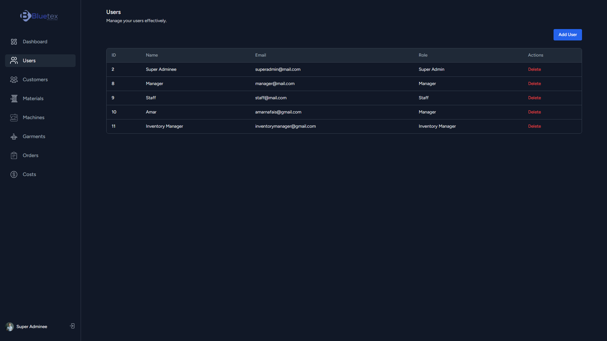

# Order Management System

A modern and intuitive **Order Management System** designed to streamline operations for garment manufacturing businesses. This system allows seamless management of orders, garments, materials, machines, and users with role-based access control.

---

## Table of Contents

1. [Features](#features)
2. [Tech Stack](#tech-stack)
3. [Installation](#installation)
4. [Usage](#usage)
5. [Screenshots](#screenshots)
6. [Contributing](#contributing)
7. [License](#license)
8. [Support](#support)

---

## Features

### **User Management**

-   Role-based access control with predefined roles:
    -   **Super Admin**, **Manager**, **Inventory Manager**, **Garment Manager**, **Staff**.
-   Manage users, assign roles, and maintain user details.
-   Display active/inactive users with real-time statistics.

-   Users

    

-   Add User Modal

    

### **Order Management**

-   Create, update, and delete orders.
-   Automatically update machine statuses based on order progress.
-   Material stock adjustments tied to order quantities.
-   Real-time updates to order statuses (e.g., Pending, In Progress, Completed, Cancelled).

### **Garment Management**

-   Assign materials and machines to garments.
-   View and manage garment details comprehensively.

### **Material Management**

-   Track and manage material stock levels.
-   Auto-update material quantities when orders are placed.

### **Machine Management**

-   Dynamic machine status updates based on orders.
-   Assign machines to garments and orders seamlessly.

### **Reporting and Analytics**

-   Generate reports for order statuses, material usage, and machine availability.
-   Visual dashboards for active/inactive users, machines, and order insights.
-   Charts for visualizing trends (e.g., completed vs. canceled orders).

### **Email Notifications**

-   Notify users of critical updates using SMTP email integration (Gmail).

---

## Tech Stack

-   **Framework**: Laravel 10.x
-   **Frontend**: Tailwind CSS
-   **Database**: MySQL
-   **Charting**: Chart.js
-   **Authentication**: Laravel Breeze with role-based access control
-   **Deployment**: Docker-ready configuration

---

## Installation

### Prerequisites

-   PHP >= 8.0
-   Composer
-   Node.js & npm
-   MySQL or any compatible database

### Steps

1. **Clone the repository**:
    ```bash
    git clone https://github.com/yourusername/order-management-system.git
    cd order-management-system
    ```
